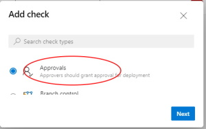

# Create Azure DevOps Environments

For multi-stage deployments (i.e. DEV/QA/PROD), a DevOps Environment should be set up for each stage that that is being published. On that Environment definition, the rules that are needed can set up, such as specific approvers that are needed to publish to that environment.

---

## Environment Setup

**Step 1:** Go to the project environments page and select New environment:

**Step 2:** Enter the name of the new environment:

**Step 3:** To add an approver for an environment, select that environment, click on the "More" ellipsis, and select "Approvals and checks"

**Step 4:** Click on the plus sign to add new checks:

**Step 5:** Select the "Approvals" check from the list:

**Step 6:** Add the authorized approvers to the list and click "Create":

---

The environment should be ready to use now!