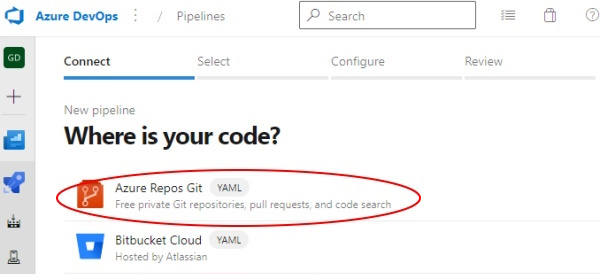
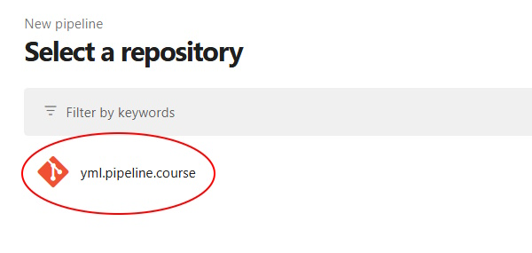
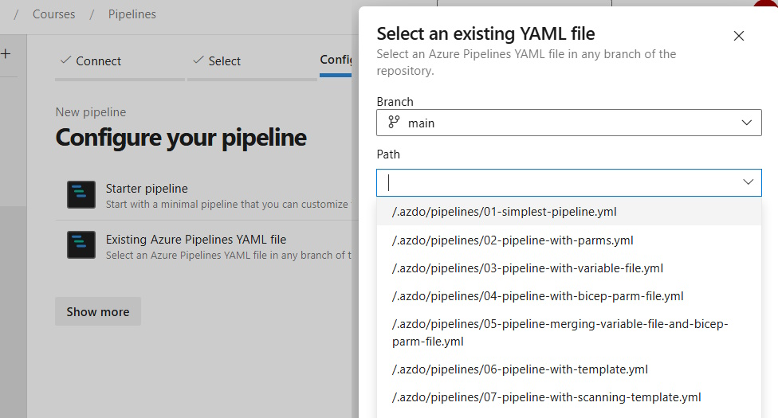
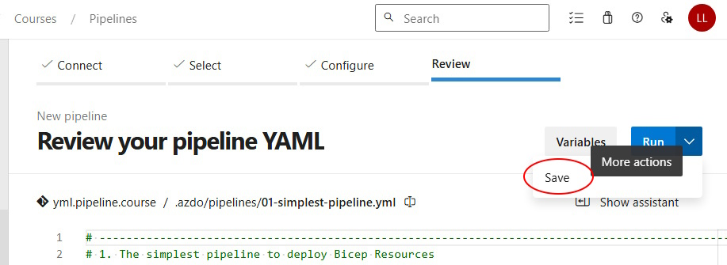

# Create Azure DevOps Pipelines

To create an Azure DevOps pipeline from an existing YML file in a GitHub repository, follow these steps.

---

**Step 1:** Click New pipeline from the Pipeline section of the Azure DevOps project

**Step 2:** Select source as GitHub:

**Step 3:** Select the GitHub repository

**Step 4:** Select Existing Pipelines YAML file

**Step 5:** Select the desired pipeline

**Step 6:** For some cases, when the pipeline source is shown, you can just click Run and start your pipeline.  However, it's usually best the first time to just Save and not Run, so select More Actions and Save the file.

**Step 7:** You may notice that by default a new pipeline created this was has the same name as the repository that it came from, not the name of the pipeline. It's best to rename it right now, to something more meaningful like the original name of the pipeline YML file.
