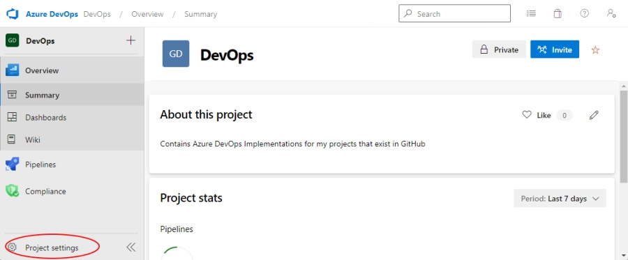
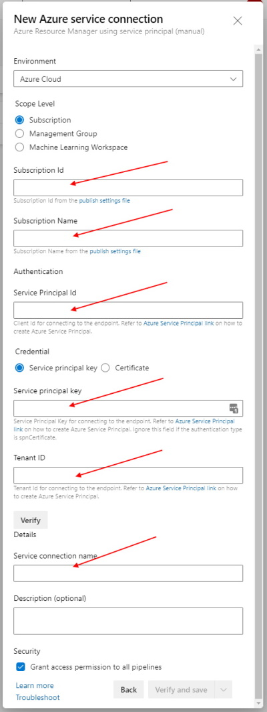
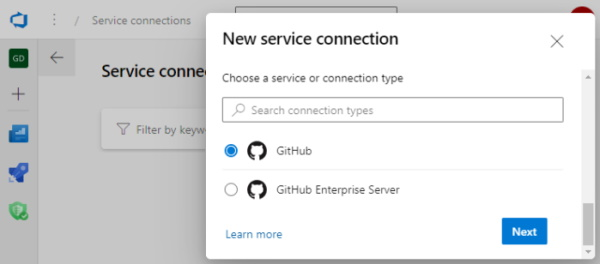

# Create Azure DevOps Service Connections

To enable Azure DevOps pipelines to run and deploy resources to Azure, an Azure Subscription Service Connection needs to be set up.

To enable Azure DevOps pipelines to read source code from a GitHub repository and deploy to Azure, both a GitHub Service Connection and an Azure Subscription Service Connection need to be set up.

---

## Azure Subscription Connection

NOTE: There are several options available here for creating the service connection. This document will show how to use the Service principal (manual) option. Other options may try to create service principals behind the scenes and the user may not have permissions to do that.

Before you begin this step, create a Service Principal and Client Secret, and record the Client Id, Tenant Id, and the Client Secret for use in the following steps.

**Step 1:** Go to the project settings page:

**Step 2:** Select Service Connections:

**Step 3:** Add new Service Connection:

**Step 4:** Select Azure Resource Manager

**Step 5:** Select the Service principal (manual) option.

**Step 6:** For this step, things that are needed include the Azure Subscription name and Id, the Azure AD Service Principal Client Id and Tenant Id, and the Client Secret that was created in the previous steps.

In the image below, the "Service Principal Id" is the Azure AD Service Principal Client Id, the "Tenant Id", and the "Service Principal Key" is the Client Secret.

(For ease of use, it is recommended that the Azure service connection name be the same as the Azure Subscription name that is being referenced.)

Fill in the info and click on the "Verify" button to validate the connection info, then click Save.

---

## GitHub Service Connection

If you need to access resources in a GitHub repository, you will need to create a GitHub Service Connection.

**Step 1:** Go to the project settings page:

**Step 2:** Select Service Connections:

**Step 3:** Add new Service Connection:

---

## GitHub Service Connection

**Step 4:** Select GitHub

**Step 5:** Authenticate GitHub using a PAT token. (For ease of use, it is recommended that the GitHub service connection name be the same as the GitHub account is being referenced.)

---

## References:
For more information, see: [https://docs.microsoft.com/en-us/azure/devops/pipelines/library/service-endpoints?view=azure-devops&tabs=yaml](https://docs.microsoft.com/en-us/azure/devops/pipelines/library/service-endpoints?view=azure-devops&tabs=yaml)

