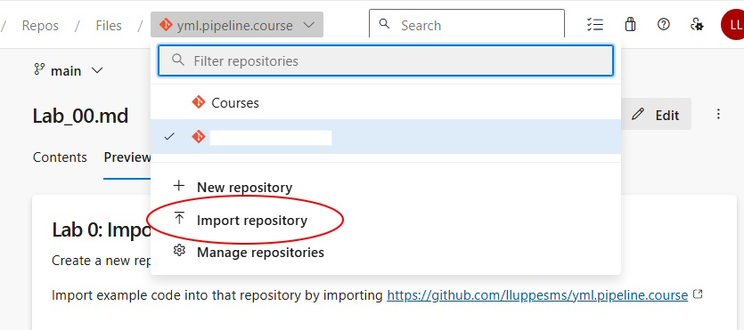
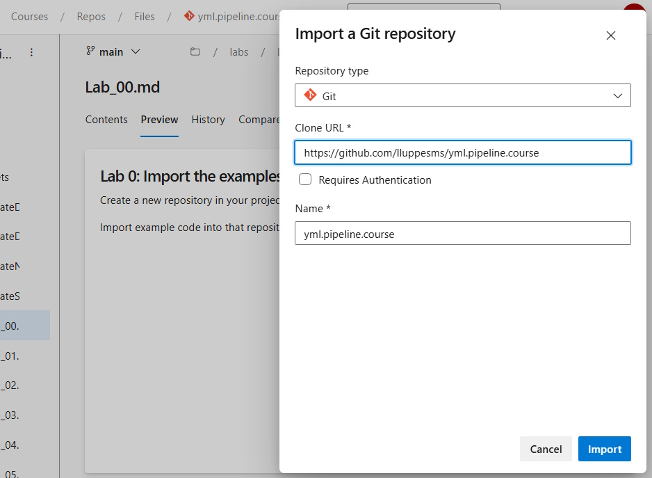

# Lab 0: Import the examples

Create a new repository in your project, by importing the example code into a repository from [https://github.com/lluppesms/yml.pipeline.course](https://github.com/lluppesms/yml.pipeline.course)

---

[Next Lab](./Lab_01.md)   [Table of Contents](./README.md)
